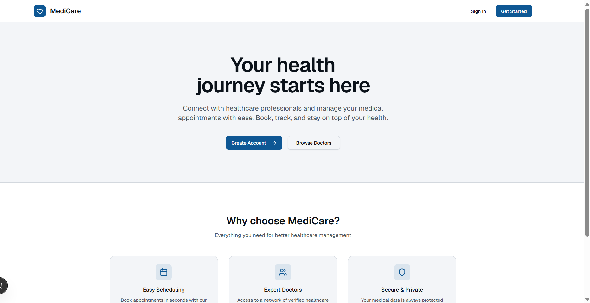
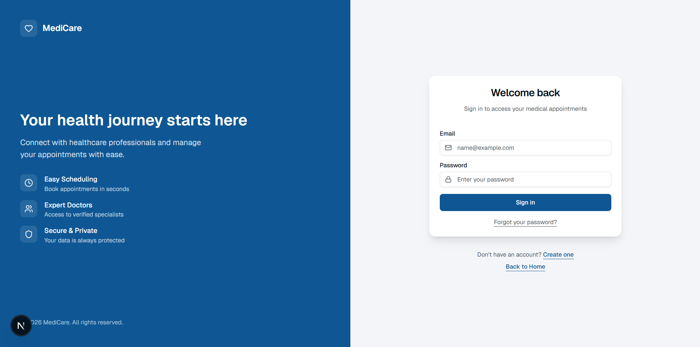
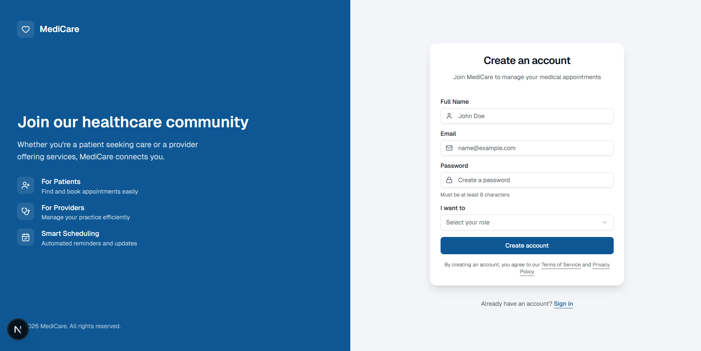
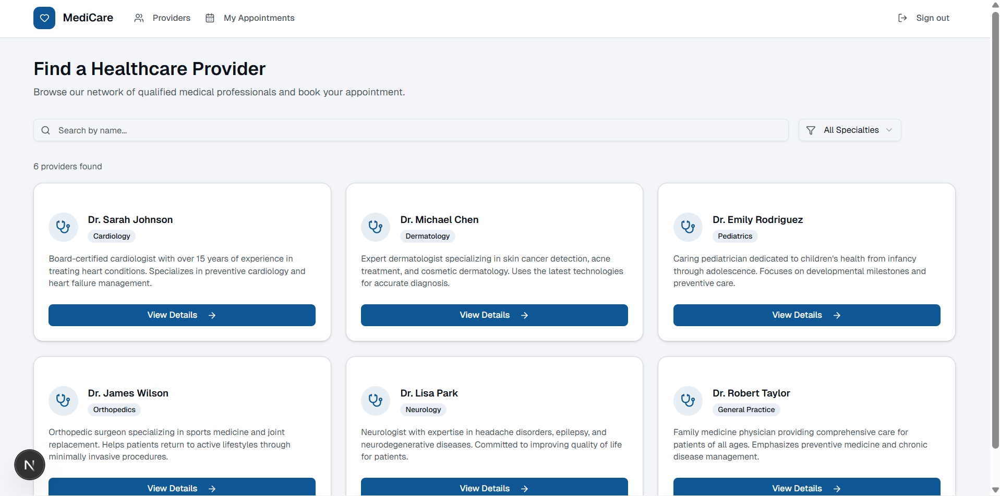
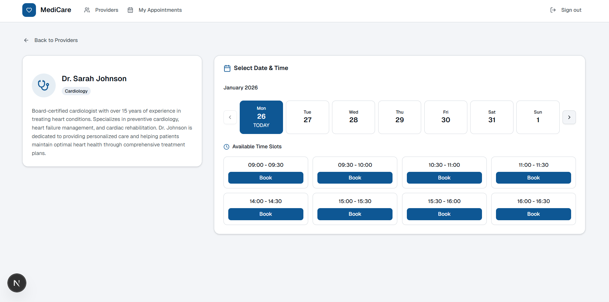
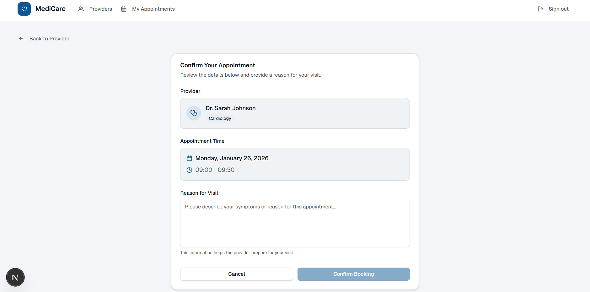
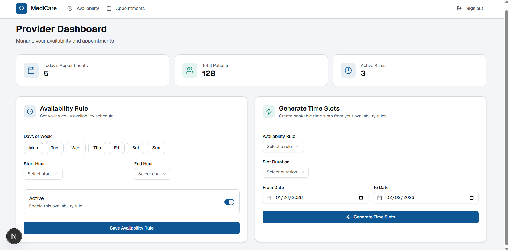
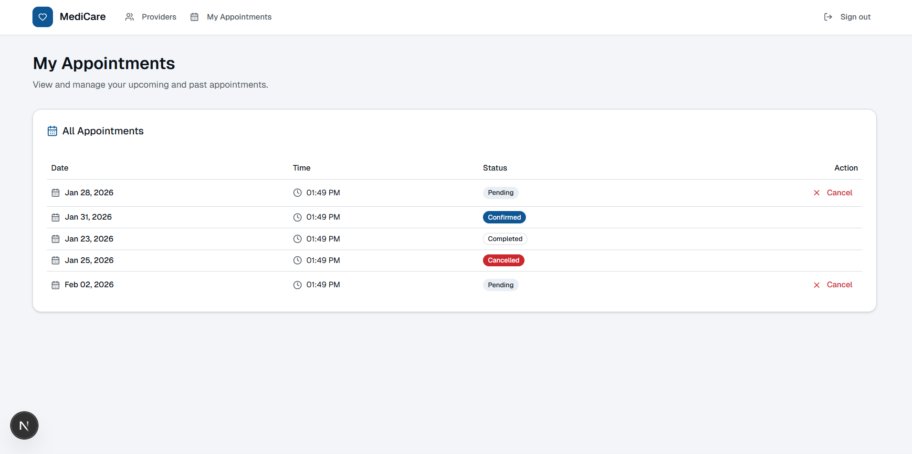
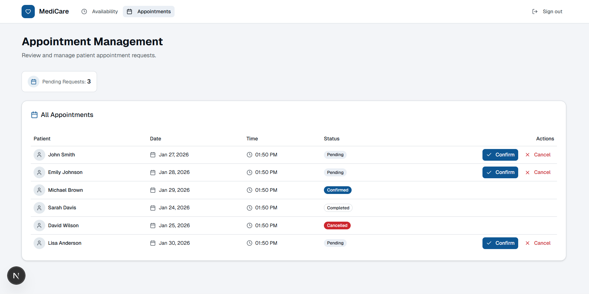
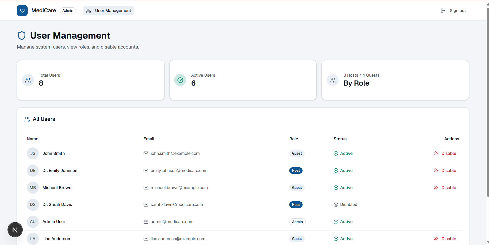

<div align="center">
  
  <h1 align="center">Hệ Thống Đặt Lịch Hẹn (Appointment Booking System)</h1>
  <p align="center">
    Một nền tảng đặt lịch hẹn trực tuyến hiện đại, thân thiện và hiệu quả, giúp kết nối người dùng với các "Host" (nhà cung cấp dịch vụ) một cách dễ dàng.
  </p>
  <p align="center">
    <a href="#-giới-thiệu"><strong>Giới thiệu</strong></a> ·
    <a href="#-giao-diện--trải-nghiệm-người-dùng"><strong>Giao diện</strong></a> ·
    <a href="#-các-chức-năng-chính"><strong>Chức năng</strong></a> ·
    <a href="#-công-nghệ-sử-dụng"><strong>Công nghệ</strong></a> ·
    <a href="#-cài-đặt--chạy-dự-án"><strong>Bắt đầu</strong></a>
  </p>
  <p align="center">
    
    
    
    
    
  </p>
</div>

---

## 📖 Giới thiệu

Dự án **Hệ Thống Đặt Lịch Hẹn** là một ứng dụng web phía client (Frontend) được xây dựng bằng Next.js, cho phép người dùng tìm kiếm, xem thông tin và đặt lịch hẹn với các chuyên gia hoặc nhà cung cấp dịch vụ (được gọi là "Host"). Hệ thống được thiết kế với ba vai trò chính:

- **👤 Người dùng (Client):** Tìm kiếm, lọc, xem và đặt lịch hẹn.
- **💼 Host (Nhà cung cấp):** Quản lý thông tin cá nhân, cài đặt lịch làm việc, và xem các lịch hẹn đã được đặt.
- **👑 Quản trị viên (Admin):** Quản lý người dùng, host và các cấu hình chung của hệ thống.

Mục tiêu của dự án là mang lại một trải nghiệm người dùng mượt mà, giao diện sạch sẽ và hiệu năng cao.

## ✨ Giao diện & Trải nghiệm người dùng

Giao diện được xây dựng với triết lý "Mobile-First", đảm bảo trải nghiệm tốt nhất trên mọi thiết bị. Dưới đây là một số màn hình chính của ứng dụng.

### 🏠 Trang chủ & Tìm kiếm

_Nơi người dùng bắt đầu hành trình tìm kiếm dịch vụ._

<!-- Thêm ảnh chụp màn hình giao diện Trang chủ ở đây -->
<div align="center">
  
</div>

### 🔑 Đăng nhập & Đăng ký

_Biểu mẫu được thiết kế tối giản, tích hợp xác thực an toàn._

<!-- Thêm ảnh chụp màn hình giao diện Đăng nhập ở đây -->
<div align="center">
  
</div>
<div align="center">
  
</div>

### 📅 Trang Chi tiết Host & Đặt lịch

_Hiển thị thông tin chi tiết về Host và lịch trống để người dùng lựa chọn._

<!-- Thêm ảnh chụp màn hình giao diện Đặt lịch ở đây -->
<div align="center">
  
</div>
<div align="center">
  
</div>
<div align="center">
  
</div>

### 📊 Trang quản lý (Dashboard)

_Dành cho Host để quản lý thông tin, lịch hẹn và người dùng._

<!-- Thêm ảnh chụp màn hình giao diện Dashboard ở đây -->
<div align="center">
  
</div>

### 📊 Trang quản lý Apointment

_Dành cho User để quản lý lịch đặt._

<!-- Thêm ảnh chụp màn hình giao diện Dashboard ở đây -->
<div align="center">
  
</div>

_Dành cho Host để quản lý lịch đặt._

<div align="center">
  
</div>

### 📊 Trang quản lý User (Admin)

_Dành cho Admin để quản lý người dùng._

<div align="center">
  
</div>

---

## 🚀 Các Chức năng chính

| Icon | Chức năng                        | Mô tả                                                                                                |
| :--: | :------------------------------- | :--------------------------------------------------------------------------------------------------- |
|  🔐  | **Xác thực Người dùng**          | Đăng ký, đăng nhập an toàn cho cả người dùng và host.                                                |
|  🔍  | **Tìm kiếm & Lọc**               | Tìm kiếm Host theo tên, chuyên môn và lọc theo các tiêu chí khác nhau.                               |
|  🗓️  | **Hệ thống Đặt lịch thông minh** | Chọn ngày, giờ dựa trên lịch trống thực tế của Host.                                                 |
|  ⚙️  | **Quản lý Lịch làm việc**        | Host có thể tự định nghĩa các quy tắc về thời gian làm việc và tạo ra các khe thời gian (timeslots). |
|  📊  | **Dashboard Quản lý**            | Giao diện quản lý riêng cho Host để xem lịch hẹn và cho Admin để quản lý toàn bộ hệ thống.           |
|  📱  | **Thiết kế Responsive**          | Tương thích hoàn hảo trên mọi thiết bị từ điện thoại di động, máy tính bảng đến máy tính để bàn.     |
|  🔔  | **Thông báo (Dự kiến)**          | Gửi email hoặc thông báo trong ứng dụng để xác nhận và nhắc nhở lịch hẹn.                            |

---

## 🏗️ Kiến trúc

Ứng dụng này là một **Frontend độc lập**, được xây dựng với **Next.js App Router**. Kiến trúc này cho phép tách biệt hoàn toàn giao diện người dùng khỏi logic xử lý ở phía máy chủ (Backend).

- **Client (Next.js):** Xử lý toàn bộ giao diện, quản lý trạng thái và tương tác của người dùng.
- **API Layer:** Giao tiếp với Backend thông qua các request HTTP (RESTful hoặc GraphQL) để lấy và gửi dữ liệu.
- **Backend (Không thuộc repo này):** Cần một máy chủ riêng để xử lý logic nghiệp vụ, xác thực và tương tác với cơ sở dữ liệu.

```
┌──────────────────┐      ┌─────────────────┐      ┌──────────────┐
│   Client         │      │   Backend API   │      │   Database   │
│   (Next.js)      ├─────►│   (Nest js ...) ├─────►│ (PostgreSQL) │
└──────────────────┘      └─────────────────┘      └──────────────┘
```

---

## 🛠️ Công nghệ sử dụng

Dự án được xây dựng với các công nghệ và thư viện hàng đầu hiện nay:

| Loại             | Công nghệ                                                                                             | Mô tả                                                     |
| :--------------- | :---------------------------------------------------------------------------------------------------- | :-------------------------------------------------------- |
| **Framework**    |                      | Framework React cho ứng dụng web hiện đại.                |
| **Ngôn ngữ**     |              | Ngôn ngữ chính, giúp mã nguồn chặt chẽ và dễ bảo trì.     |
| **Giao diện**    |                       | Thư viện xây dựng giao diện người dùng.                   |
| **Styling**      |  | Framework CSS utility-first để tạo giao diện nhanh chóng. |
| **Component UI** |                | Bộ component UI đẹp mắt, tùy biến cao và dễ truy cập.     |
| **Icon**         | `lucide-react`                                                                                        | Bộ sưu tập icon open-source đẹp và nhất quán.             |
| **Form**         | `react-hook-form` & `zod`                                                                             | Quản lý biểu mẫu mạnh mẽ và xác thực schema.              |
| **Linting**      | `ESLint`                                                                                              | Đảm bảo chất lượng và tính nhất quán của mã nguồn.        |
| **Deployment**   |                         | Nền tảng deployment tối ưu cho Next.js.                   |

---

## 🏁 Cài đặt & Chạy dự án

Làm theo các bước sau để chạy dự án trên máy của bạn:

**1. Clone Repository**

```bash
git clone https://github.com/liptwo/fe-apointment-website.git
cd fe-apointment-website
```

**2. Cài đặt Dependencies**
_Dự án sử dụng `npm`, `yarn` hoặc `pnpm`. Dựa vào file lock của bạn, hãy chọn lệnh phù hợp._

```bash
npm install
```

**3. Cấu hình Biến môi trường**
_Sao chép file `.env.example` thành `.env.local` và điền các thông tin cần thiết, đặc biệt là URL của Backend API._

```bash
cp .env.example .env.local
```

```env
# .env.local
NEXT_PUBLIC_API_URL=http://localhost:8080/api
```

**4. Chạy Development Server**

```bash
npm run dev
```

Mở trình duyệt và truy cập [http://localhost:3000](http://localhost:3000).

---

## 💡 Hướng phát triển trong tương lai

- [ ] **Tích hợp Thanh toán:** Kết nối với các cổng thanh toán như Stripe, PayPal để thu phí dịch vụ.
- [ ] **Hỗ trợ Đa ngôn ngữ (i18n):** Cho phép người dùng chuyển đổi giữa các ngôn ngữ khác nhau.
- [ ] **Gửi Email & SMS Nhắc nhở:** Tự động gửi thông báo nhắc lịch hẹn cho người dùng và host.
- [ ] **Đánh giá & Xếp hạng Host:** Cho phép người dùng để lại đánh giá sau khi hoàn thành lịch hẹn.
- [ ] **Real-time Chat:** Tích hợp chat trực tiếp giữa người dùng và host.

---

## ❤️ Đóng góp

Mọi sự đóng góp đều được chào đón! Nếu bạn muốn đóng góp, vui lòng fork repository và tạo một Pull Request.

1.  **Fork** dự án này.
2.  Tạo một branch mới (`git checkout -b feature/AmazingFeature`).
3.  Commit các thay đổi của bạn (`git commit -m 'Add some AmazingFeature'`).
4.  Push lên branch (`git push origin feature/AmazingFeature`).
5.  Mở một **Pull Request**.

## 📄 Giấy phép

Dự án này được cấp phép theo **MIT License**. Xem file `LICENSE` để biết thêm chi tiết.

</div>
